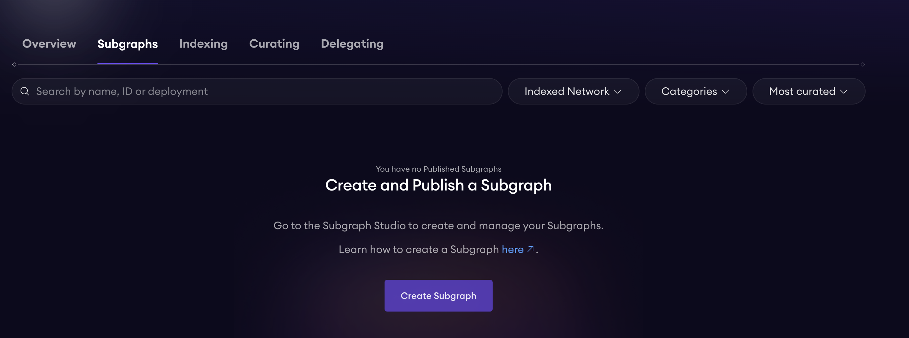
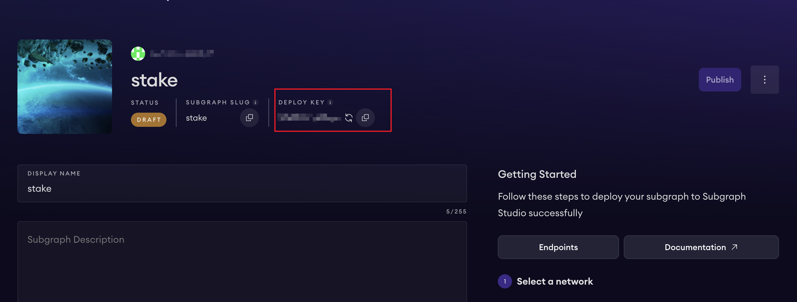
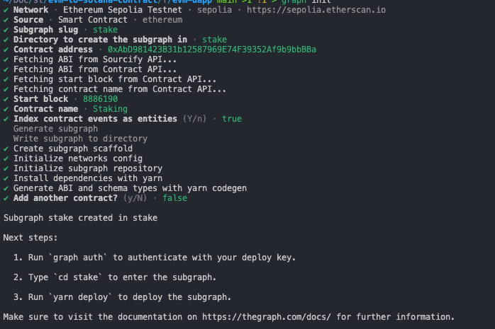

# EVM Staking DApp

A comprehensive staking DApp that demonstrates how to interact with Ethereum smart contracts using modern Web3 technologies. This repository serves as a practical guide for developers learning to build decentralized applications with contract reading, writing, and event tracking capabilities.

## 🚀 Features

### Core Functionality

- **🔗 Wallet Integration**: Seamless wallet connection using RainbowKit with support for multiple wallet providers
- **📖 Contract Reading**: Real-time reading of smart contract state (allowance, balance, stake info) using Viem and Wagmi
- **✍️ Contract Writing**: Interactive contract interactions including token approval, staking, and unstaking operations
- **📊 Subgraph Integration**: Real-time event tracking and display of reward history using The Graph's subgraph
- **💡 Smart Transaction Flow**: Intelligent approval and staking flow with automatic allowance checking

### User Experience

- **Real-time Status Updates**: Live loading states for all blockchain operations
- **Automatic Transaction Flow**: Smart approval → staking sequence with allowance validation
- **Error Handling**: Comprehensive error display with user-friendly messages

## 🛠️ Tech Stack

### Frontend Framework

- **Next.js 15**: React framework with App Router
- **React 19**: Latest React with modern hooks and patterns
- **TypeScript**: Full type safety throughout the application

### Web3 Integration

- **Wagmi**: React hooks for Ethereum
- **Viem**: Low-level Ethereum interface
- **RainbowKit**: Wallet connection UI components

### Data & State Management

- **GraphQL**: Subgraph queries for blockchain events

### Development Tools

- **Node.js**: v22.10.0+ required
- **Package Manager**: npm, yarn, or pnpm supported

## 🏗️ Project Structure

```
evm-dapp/
├── src/
│   ├── components/
│   │   ├── StakeTokens.tsx          # Staking input and approval logic
│   │   ├── UnstakeTokens.tsx        # Unstaking operations
│   │   ├── StakeInfo.tsx            # Display stake information
│   │   ├── StakingActions.tsx       # Container for staking components
│   │   ├── RewardHistory.tsx        # Subgraph-based reward history
│   │   └── ErrorModal.tsx           # Global error display
│   ├── pages/
│   │   └── index.tsx                # Main application page
│   ├── styles/                      # CSS Modules for component styling
│   ├── utils/
│   │   └── tokenUtils.ts            # Token conversion utilities
│   ├── abi/                         # Smart contract ABIs
│   └── wagmi.ts                     # Wagmi configuration
├── package.json                     # Dependencies and scripts
├── tsconfig.json                    # TypeScript configuration
├── next.config.js                   # Next.js configuration
├── .env.example                     # Environment variables template
└── README.md                        # Project documentation
```

## 🚀 Setup & Installation

### Prerequisites

- Node.js v22.10.0 or higher
- npm, yarn, or pnpm package manager
- MetaMask or other Web3 wallet
- Access to Ethereum testnet (Sepolia recommended)

### 1. Clone Repository

```bash
git clone <repository-url>
cd evm-to-solana-contract/frontend/evm-dapp
```

### 2. Install Dependencies

```bash
# Using npm
npm install

# Using yarn
yarn install

# Using pnpm
pnpm install
```

### 3. Environment Configuration

```bash
# Copy environment template
cp env.example .env.local
```

Update `.env.local` with your configuration:

```bash
# Graph API Key for subgraph queries
NEXT_PUBLIC_GRAPH_API_KEY=your_graph_api_key_here

# Alchemy RPC URL for Ethereum testnet
NEXT_PUBLIC_ALCHEMY_RPC_URL=https://eth-sepolia.g.alchemy.com/v2/YOUR_API_KEY

```

### 4. Start Development Server

```bash
npm run dev
# or
yarn dev
# or
pnpm dev
```

The application will be available at `http://localhost:3000`

## 🔧 Smart Contract Integration

### Contract Reading

The DApp demonstrates reading contract state using Wagmi hooks:

```typescript
// Reading allowance
const { data: currentAllowance } = useReadContract({
  address: STAKING_TOKEN_ADDRESS,
  abi: stakingTokenAbi,
  functionName: "allowance",
  args: [address, STAKING_CONTRACT_ADDRESS],
});

// Reading stake information
const { data: stakeInfo } = useReadContract({
  address: STAKING_CONTRACT_ADDRESS,
  abi: stakingAbi,
  functionName: "getStakeInfo",
  args: [address],
});
```

### Contract Writing

Interactive contract operations with proper error handling:

```typescript
// Token approval
const { writeContract: approveContract } = useWriteContract();

const handleApprove = () => {
  approveContract({
    address: STAKING_TOKEN_ADDRESS,
    abi: stakingTokenAbi,
    functionName: "approve",
    args: [STAKING_CONTRACT_ADDRESS, amountWei],
  });
};

// Staking operation
const { writeContract: stakeContract } = useWriteContract();

const handleStake = () => {
  stakeContract({
    address: STAKING_CONTRACT_ADDRESS,
    abi: stakingAbi,
    functionName: "stake",
    args: [amountWei],
  });
};
```

### Transaction Flow Management

Smart approval → staking sequence with allowance validation:

```typescript
// Check allowance before staking
if (currentAllowance < stakeAmountWei) {
  // First approve, then auto-stake when allowance updates
  handleApprove();
} else {
  // Direct staking if allowance is sufficient
  handleStake();
}
```

## 📊 Subgraph Configuration

### What is a Subgraph?

A subgraph is a GraphQL API that indexes blockchain data, making it easy to query historical events and contract state changes.

### Setting Up Your Subgraph

#### 1. Create Subgraph on The Graph

- Visit [Quick Start](https://thegraph.com/docs/it/subgraphs/quick-start/)

### Key Snapshots

| Step                       | Description                                        | Screenshot                                                  |
| -------------------------- | -------------------------------------------------- | ----------------------------------------------------------- |
| **1. Create Subgraph**     | Create a new subgraph on The Graph Studio          |          |
| **2. Get Deploy Key**      | Obtain the deployment key for your subgraph        |         |
| **3. Initialize Subgraph** | Set up your local subgraph development environment |  |

#### 2. Query from DApp

```typescript
const query = gql`
  {
    rewardClaimeds(first: 10, orderBy: blockNumber, orderDirection: desc) {
      id
      user
      reward
      blockNumber
    }
  }
`;

const { data, refetch, isLoading, error, isRefetching } = useQuery<{
  rewardClaimeds: RewardRecord[];
}>({
  queryKey: ["reward-history"],
  async queryFn() {
    return await request(
      process.env.NEXT_PUBLIC_GRAPH_URL || "",
      query,
      {},
      headers
    );
  },
  refetchInterval: 30000, // Refetch every 30 seconds
  refetchOnWindowFocus: true, // Refetch when window gains focus
  staleTime: 10000, // Data is considered stale after 10 seconds
});
```

## 🔍 Key Learning Points

### 1. Wallet Connection with RainbowKit

- Automatic wallet detection and connection
- Support for multiple wallet providers
- Real-time connection state management

### 2. Contract Interaction Patterns

- Reading contract state with `useReadContract`
- Writing to contracts with `useWriteContract`
- Transaction receipt monitoring with `useWaitForTransactionReceipt`

### 3. Transaction Flow Management

- Approval → Staking sequence
- Allowance validation and auto-staking
- Error handling and user feedback

### 4. Subgraph Integration

- Real-time event tracking
- Historical data queries
- Automatic data refresh

### 5. State Management

- React Query for server state
- Local state for UI interactions
- Proper dependency management in useEffect
