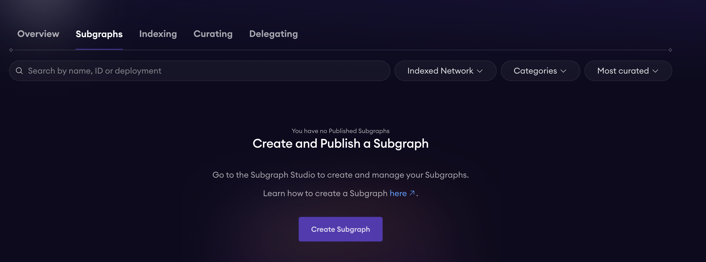
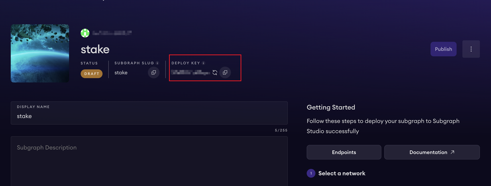
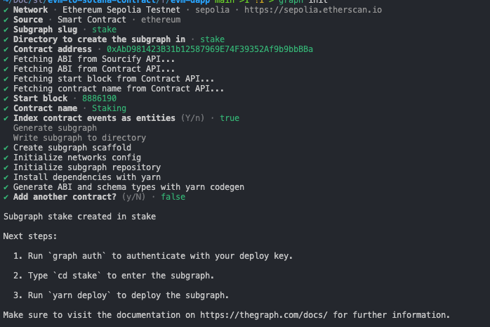

# EVM Staking DApp

A comprehensive staking DApp that demonstrates how to interact with Ethereum smart contracts using modern Web3 technologies. This repository serves as a practical guide for developers learning to build decentralized applications with contract reading, writing, and event tracking capabilities.

> **TESTNET ONLY (Sepolia)**
>
> This application is deployed and runs exclusively on **Ethereum Sepolia Testnet**.

## Features

### Core Functionality

- **Multi-Wallet Support**: Connect with MetaMask, WalletConnect, Coinbase Wallet, and more via RainbowKit
- **Token Staking**: Stake tokens to earn rewards with real-time tracking
- **Claim Rewards**: Claim accumulated staking rewards with one click
- **Subgraph Integration**: Real-time event tracking and reward history using The Graph
- **Event Listener**: Track on-chain events (Staked, Unstaked, RewardClaimed) via subgraph

### Transaction Features

- **Smart Approval Flow**: Automatic allowance checking with approve → stake sequence
- **Contract Reading**: Real-time reading of contract state using Wagmi hooks
- **Contract Writing**: Interactive staking, unstaking and claim operations
- **Error Handling**: Comprehensive error display with user-friendly messages

## Tech Stack

### Frontend Framework

- **Vite 5**: Fast build tool and development server
- **React 19**: Latest React with modern hooks and patterns
- **TypeScript**: Full type safety throughout the application

### Web3 Integration

- **Wagmi**: React hooks for Ethereum
- **Viem**: Low-level Ethereum interface
- **RainbowKit**: Wallet connection UI components

### Styling

- **Tailwind CSS**: Utility-first CSS framework

### Data & State Management

- **GraphQL**: Subgraph queries for blockchain events

### Development Tools

- **Package Manager**: pnpm (recommended)

## Project Structure

```
evm-dapp/
├── src/
│   ├── main.tsx                       # Application entry point with providers
│   ├── App.tsx                        # Main application component
│   ├── components/
│   │   ├── StakeTokens.tsx            # Staking input and approval logic
│   │   ├── UnstakeTokens.tsx          # Unstaking operations
│   │   ├── ClaimRewards.tsx           # Claim accumulated rewards
│   │   ├── StakingActions.tsx         # Container for staking components
│   │   ├── RewardHistory.tsx          # Stake overview + subgraph reward history
│   │   ├── ErrorModal.tsx             # Global error display
│   │   └── GlobalToast.tsx            # Stake event notifications
│   ├── hooks/
│   │   ├── useStake.ts                # Staking logic (approve → stake flow)
│   │   └── useStakeEvents.ts          # On-chain event listener
│   ├── utils/
│   │   └── tokenUtils.ts              # Token conversion and formatting
│   ├── abi/
│   │   ├── stakeAbi.ts                # Staking contract ABI
│   │   └── StakingTokenABI.ts         # ERC20 staking token ABI
│   ├── styles/
│   │   └── globals.css                # Global styles
│   └── wagmi.ts                       # Wagmi + RainbowKit configuration
├── stake/                             # The Graph subgraph project
├── snapshots/                         # Documentation screenshots
├── consts.ts                          # Contract addresses
├── package.json
├── tsconfig.json
├── tailwind.config.js                 # Tailwind CSS configuration
├── vite.config.ts
├── env.example                        # Environment variables template
└── README.md
```

## Setup & Installation

### Prerequisites

- Node.js v22.10.0 or higher
- pnpm package manager
- MetaMask or other Web3 wallet **configured for Sepolia Testnet**
- **Sepolia ETH** for gas fees — get from [Google Cloud Faucet](https://cloud.google.com/application/web3/faucet/ethereum/sepolia) or [Alchemy Faucet](https://www.alchemy.com/faucets/ethereum-sepolia)

> **Note**: This DApp runs on **Ethereum Sepolia Testnet** only. Make sure your wallet is connected to Sepolia network.

### 1. Clone Repository

```bash
git clone <repository-url>
cd evm-to-solana/frontend/evm-dapp
```

### 2. Install Dependencies

```bash
pnpm install
```

### 3. Environment Configuration

```bash
cp env.example .env.local
```

Update `.env.local` with your configuration:

```bash
# Alchemy RPC URL for Sepolia
VITE_RPC_URL=https://eth-sepolia.g.alchemy.com/v2/YOUR_API_KEY

# The Graph subgraph URL for reward history queries
VITE_GRAPH_URL=https://api.studio.thegraph.com/query/YOUR_ID/YOUR_SUBGRAPH/version/latest

# The Graph API key for authenticated subgraph queries
VITE_GRAPH_API_KEY=your_graph_api_key_here
```

### 4. Deploy Contracts & Mint Tokens

Before using the DApp, you need to deploy the staking contracts and mint test tokens. See [`contract/evm-staking/README.md`](../../contract/evm-staking/README.md) for full deployment instructions.

After deployment, update the contract addresses in `consts.ts` with the deployment output.

To mint tokens to your test wallet, use the deployed RestrictedStakingToken contract on [Sepolia Etherscan](https://sepolia.etherscan.io/) — call `mint(address to, uint256 amount)` with the deployer wallet (only the contract owner can mint).

### 5. Start Development Server

```bash
pnpm dev
```

The application will be available at `http://localhost:5173`

## Deployed Contracts (Sepolia)

Current deployment (from `consts.ts`):

- **RestrictedStakingToken**: `0xeac74faE452fCCdcD1F56284e903aC6F0B4AA739`
- **RewardToken**: `0x3b3D281AFCe9f7B4e4980C3E1d28c3C20Ebf22Fb`
- **Staking**: `0xE4a35E1Ea3A5C2c5296FCE9C8Dc5B3aB25511C90`

## Subgraph Configuration

### What is a Subgraph?

A subgraph is a GraphQL API that indexes blockchain data, making it easy to query historical events and contract state changes.

### Setting Up Your Subgraph

Visit [The Graph Quick Start](https://thegraph.com/docs/it/subgraphs/quick-start/) to create and deploy a subgraph for your staking contract.

| Step                       | Description                                        | Screenshot                                                  |
| -------------------------- | -------------------------------------------------- | ----------------------------------------------------------- |
| **1. Create Subgraph**     | Create a new subgraph on The Graph Studio          |          |
| **2. Get Deploy Key**      | Obtain the deployment key for your subgraph        |         |
| **3. Initialize Subgraph** | Set up your local subgraph development environment |  |

## Important Notes

1. **Testnet Only (Sepolia)**: This application runs exclusively on **Ethereum Sepolia Testnet**. **Do NOT use mainnet tokens or real funds.**
2. **Sepolia ETH Required**: Get from faucets linked above to pay for gas fees.
3. **Minting Tokens**: Only the contract owner (deployer wallet) can call `mint()`. Use Etherscan's Write Contract UI to mint tokens to test wallets.
4. **Never hardcode private keys**: Use environment variables for all sensitive credentials. The `.env` file is gitignored.
5. **Subgraph API Key**: You need a Graph API key to query reward history.
